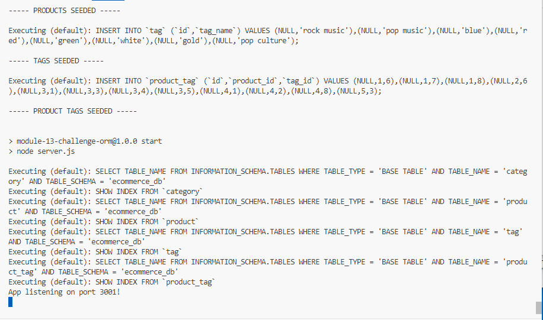

# E-Commerce Back End

## Description

E-Commerce Back End is a back end for an e-commerce site. It uses an Express.js API to use Sequelize to interact with a MySQL database.

## Installation

Follow the below steps to install on local computer.
- Step 1: clone project to your local computer.
- Step 2: navigate to "E-Commerce-Back-End" folder.
- Step 3: modify .env.Example file in "E-Commerce-Back-End" folder with your MySQL credentials.
- Step 4: rename .env.Example to .env.
- Step 5: create database by running "source db/schema.sql" in mysql client.
- Step 6: run "npm install" to install the required modules (dotenv, express, mysql2 sequelize).
- Step 7: run "node seeds/index.js" to seed example data into the database.
- Step 8: run "npm start" to run a local back end webpage at http://localhost:3001 
    
## Usage

- Step 1: Install Insomnia.
- Step 2: Open Insomnia.
- Step 3: Create a new workspace.
- Step 4: Import exampole requests from Assets/api_client/Insomnia_E-Commerce-BE.json.
- Step 5: Run requests to test.

    

    

## Credits

Backend powered by [nodejs](https://nodejs.org/en), [express](https://www.npmjs.com/package/express), [mysql2](https://www.npmjs.com/package/mysql2), [Sequelize](https://www.npmjs.com/package/sequelize).